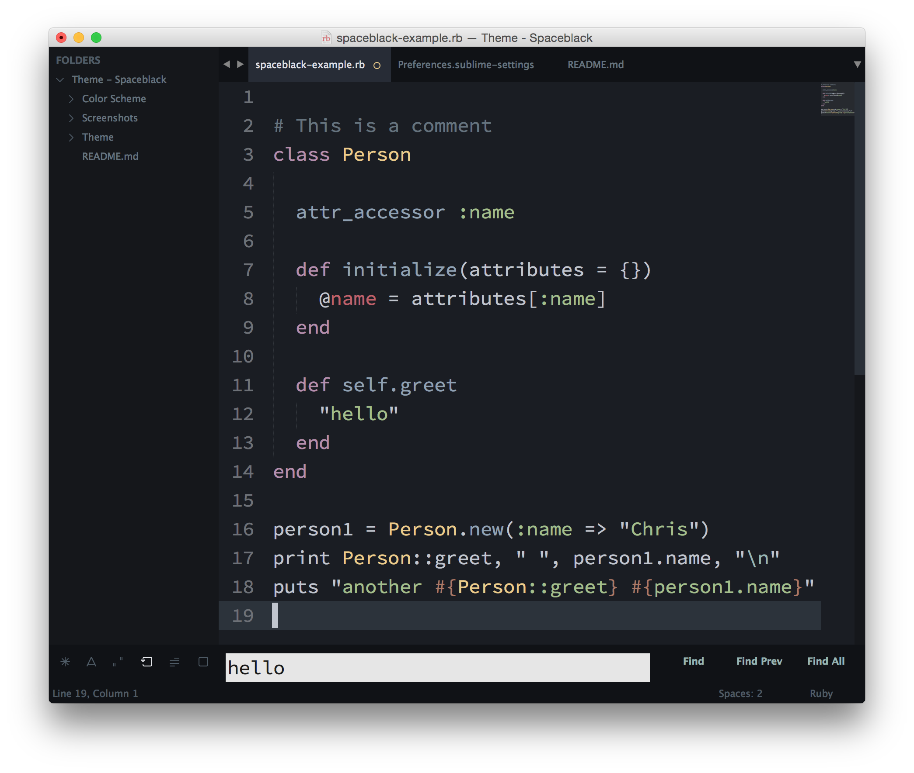
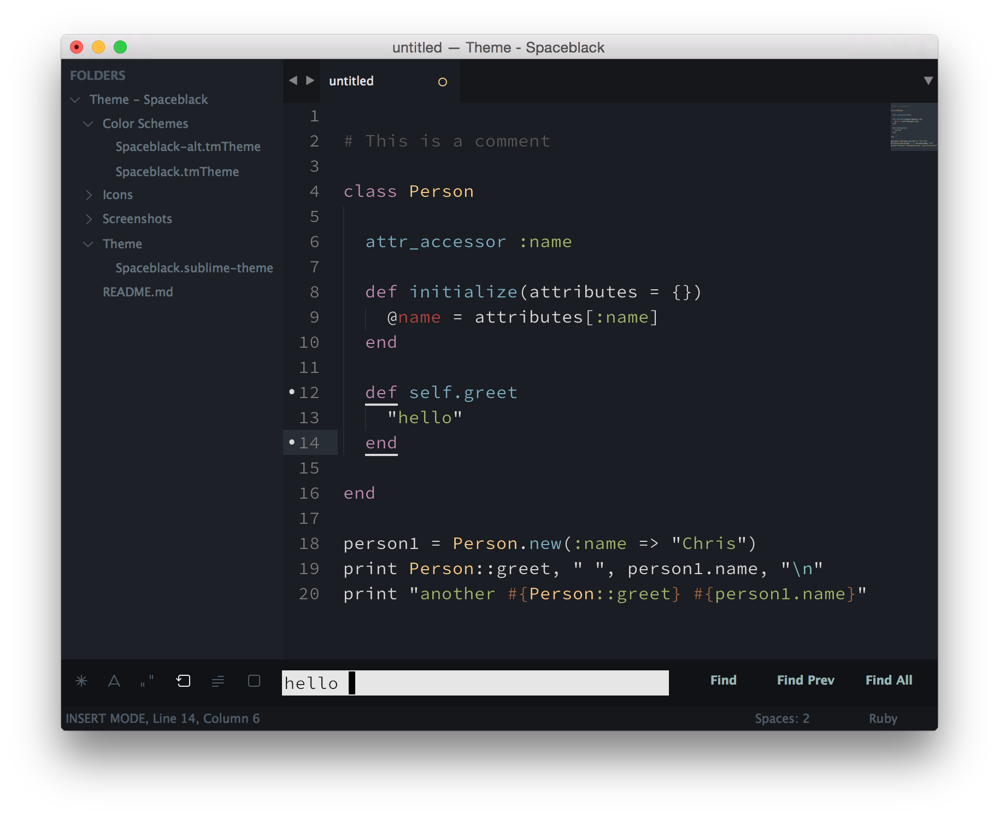
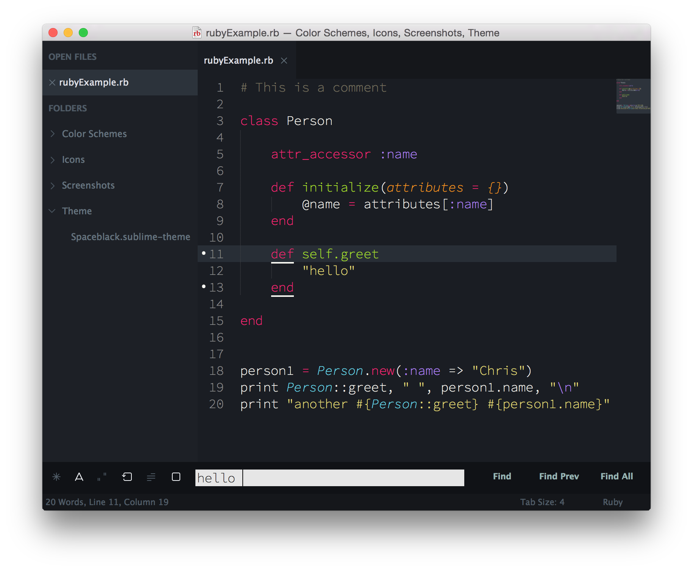
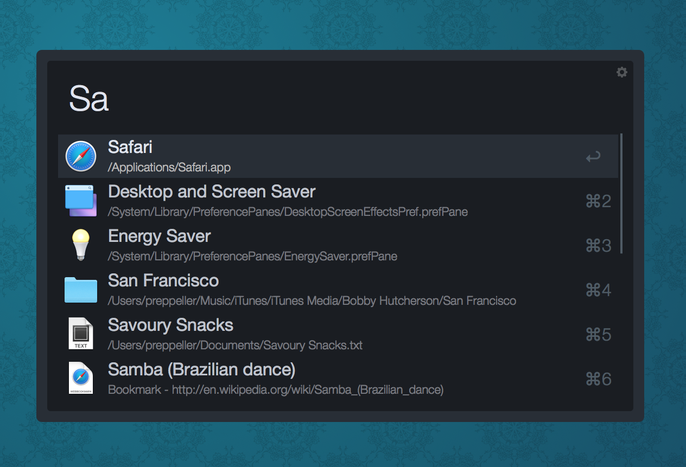

# Spaceblack

A modified version of the popular [Spacegray](https://github.com/kkga/spacegray) theme for those who prefer it dark.

***

#### Spaceblack with Spaceblack.tmTheme


#### Spaceblack with Spaceblack-alt.tmTheme


#### Spaceblack with Spaceblack-Monokai.tmTheme


*The font used in the screenshots is [__Source Code Pro__](https://github.com/adobe/Source-Code-Pro).*

***

### Installation

#### Via Package Control

The easiest way to install is using [Sublime Package Control](https://sublime.wbond.net), where Spaceblack is listed as `Theme - Spaceblack`.

1. Open Command Palette using menu item `Tools -> Command Palette...` (<kbd>⇧</kbd><kbd>⌘</kbd><kbd>P</kbd> on Mac)
2. Choose `Package Control: Install Package`
3. Find `Theme - Spaceblack` and hit <kbd>Enter</kbd>

#### Manually

You can also install the theme manually:

1. [Download the .zip](https://github.com/saadq/Spaceblack/archive/master.zip)
2. Unzip and rename the folder to `Theme - Spaceblack`
3. Copy the folder into `Packages` directory, which you can find using the menu item `Sublime Text -> Preferences -> Browse Packages...`

***

### Activation

You can activate the theme and colour scheme by modifying your Preferences-User file which you can find by using the menu item `Sublime Text -> Preferences -> Settings - User` (<kbd>⌘</kbd><kbd>,</kbd> on Mac).

#### Settings for Spaceblack with default colour scheme

```json
{
  "theme": "Spaceblack.sublime-theme",
  "color_scheme": "Packages/Theme - Spaceblack/Color Schemes/Spaceblack.tmTheme"
}
```

#### Settings for Spaceblack with the alternate colour scheme

```json
{
  "theme": "Spaceblack.sublime-theme",
  "color_scheme": "Packages/Theme - Spaceblack/Color Schemes/Spaceblack-alt.tmTheme"
}
```

#### Settings for Spaceblack with Monokai colour scheme

```json
{
  "theme": "Spaceblack.sublime-theme",
  "color_scheme": "Packages/Theme - Spaceblack/Color Schemes/Spaceblack-Monokai.tmTheme"
}
```

***

### User Settings
Use the following (optional) settings to modify aspects of the theme. Per element, copy and paste one of the following lines into your user preferences file.

#### Tab labels font size


```json
"spaceblack_tabs_font_small": true
```
```json
"spaceblack_tabs_font_normal": true
```
```json
"spaceblack_tabs_font_large": true
```
```json
"spaceblack_tabs_font_xlarge": true
```

#### Tab size

Tab height:

```json
"spaceblack_tabs_small": true
```
```json
"spaceblack_tabs_normal": true
```
```json
"spaceblack_tabs_large": true
```
```json
"spaceblack_tabs_xlarge": true
```
```json
"spaceblack_tabs_xxlarge": true
```

Tab width:

```json
"spaceblack_tabs_auto_width": true
```
#### Sidebar label font size

```json
"spaceblack_sidebar_font_small": true
```
```json
"spaceblack_sidebar_font_normal": true
```
```json
"spaceblack_sidebar_font_large": true
```
```json
"spaceblack_sidebar_font_xlarge": true
```

####Sidebar tree row height

```json
"spaceblack_sidebar_tree_small": true
```
```json
"spaceblack_sidebar_tree_normal": true
```
```json
"spaceblack_sidebar_tree_large": true
```
```json
"spaceblack_sidebar_tree_xlarge": true
```
```json
"spaceblack_sidebar_tree_xxlarge": true
```

#### Hide tab navigation icons
```json
"enable_tab_scrolling": false
```
***

###Extras
####Spaceblack is now available for Alfred
**Download:** [Spaceblack Alfred 1.0](https://github.com/TheBaronHimself/Spaceblack/raw/master/Extras/SpaceblackAlfred-1.0.zip)



***

### Contributors

* Simon-Claudius Wystrach ([GitHub](http://www.github.com/TheBaronHimself) | [Twitter](http://www.twitter.com/TheBaronHimself))
	- Owns the repo since August 5th, 2015
  - Created the Spaceblack-alt.tmTheme
  - Added changes/improvements to Spaceblack.sublime-theme, Spaceblack.tmTheme and Spaceblack-Monokai.tmTheme
  - Restored user configuration options and added XXL variants
  - Created Spaceblack for Alfred
  - Updated documentation

* Saad Quadri ([GitHub](https://github.com/saadq) | [Twitter](https://twitter.com/SaadQuadri))
  - Initiated the project
  - Owned the repo until August 5th, 2015
  - Created Spaceblack.sublime-theme, Spaceblack-alt.tmTheme and Spaceblack-Monokai.tmTheme


* Tomek Wójcik ([GitHub](https://github.com/tomekwojcik))
	- Imported Spacegray icons

***

### Credits

Spaceblack is based on the magnificent [Spacegray](https://github.com/kkga/spacegray) by [kkga](https://github.com/kkga).
